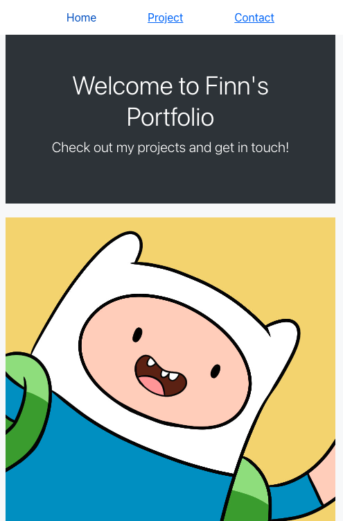

# React Portfolio
This is a React-based portfolio website project that includes a homepage, contact page, and project page with image gallery.

## Deployed Link
https://main--sprightly-sopapillas-14f971.netlify.app/

## Screenshot

## File Structure
The project is structured as follows:

    ├── public/
    │   ├── index.html
    ├── src/
    │   ├── components/
    │   │   ├── Header.js
    │   │   └── Gallery.js
    │   ├── pages/
    │   │   ├── Contact.js
    │   │   ├── Home.js
    │   │   └── Project.js
    │   ├── App.js
    │   ├── index.js
    │   └── index.css
    └── package.json

* public/: Contains the index.html file and project images.

* src/: Contains the source code for the React components and pages.

* src/components/: Contains the reusable components used in the pages.

* src/pages/: Contains the main pages of the portfolio.

* src/App.js: Contains the routing and overall app structure.

* src/index.js: Contains the code to render the app to the DOM.
* package.json: Contains the dependencies and scripts for the project.

## Dependencies
This project uses the following dependencies:

    "react": 18.2.0
    "react-dom": 18.2.0
    "react-router-dom": 6.9.0
    "react-scripts": 5.0.1
    "bootstrap": version 5.1.3
    "react-bootstrap": version 2.0.0-beta.6

## Credits
This project was created by the author.

Photo and infomation were from Cartoon Network.

## Getting Started with Create React App

This project was bootstrapped with [Create React App](https://github.com/facebook/create-react-app).

## Installation
To install the necessary dependencies for this project, run the following command:

`npm install`

## Usage

To start the React server, run the following command:

`npm start`

This will start the server on http://localhost:3000.

## Available Scripts

In the project directory, you can also run:

### `npm test`

Launches the test runner in the interactive watch mode.\
See the section about [running tests](https://facebook.github.io/create-react-app/docs/running-tests) for more information.

### `npm run build`

Builds the app for production to the `build` folder.\
It correctly bundles React in production mode and optimizes the build for the best performance.

The build is minified and the filenames include the hashes.\
Your app is ready to be deployed!

See the section about [deployment](https://facebook.github.io/create-react-app/docs/deployment) for more information.

### `npm run eject`

**Note: this is a one-way operation. Once you `eject`, you can't go back!**

If you aren't satisfied with the build tool and configuration choices, you can `eject` at any time. This command will remove the single build dependency from your project.

Instead, it will copy all the configuration files and the transitive dependencies (webpack, Babel, ESLint, etc) right into your project so you have full control over them. All of the commands except `eject` will still work, but they will point to the copied scripts so you can tweak them. At this point you're on your own.

You don't have to ever use `eject`. The curated feature set is suitable for small and middle deployments, and you shouldn't feel obligated to use this feature. However we understand that this tool wouldn't be useful if you couldn't customize it when you are ready for it.

## Learn More

You can learn more in the [Create React App documentation](https://facebook.github.io/create-react-app/docs/getting-started).

To learn React, check out the [React documentation](https://reactjs.org/).

### Code Splitting

This section has moved here: [https://facebook.github.io/create-react-app/docs/code-splitting](https://facebook.github.io/create-react-app/docs/code-splitting)

### Analyzing the Bundle Size

This section has moved here: [https://facebook.github.io/create-react-app/docs/analyzing-the-bundle-size](https://facebook.github.io/create-react-app/docs/analyzing-the-bundle-size)

### Making a Progressive Web App

This section has moved here: [https://facebook.github.io/create-react-app/docs/making-a-progressive-web-app](https://facebook.github.io/create-react-app/docs/making-a-progressive-web-app)

### Advanced Configuration

This section has moved here: [https://facebook.github.io/create-react-app/docs/advanced-configuration](https://facebook.github.io/create-react-app/docs/advanced-configuration)

### Deployment

This section has moved here: [https://facebook.github.io/create-react-app/docs/deployment](https://facebook.github.io/create-react-app/docs/deployment)

### `npm run build` fails to minify

This section has moved here: [https://facebook.github.io/create-react-app/docs/troubleshooting#npm-run-build-fails-to-minify](https://facebook.github.io/create-react-app/docs/troubleshooting#npm-run-build-fails-to-minify)
